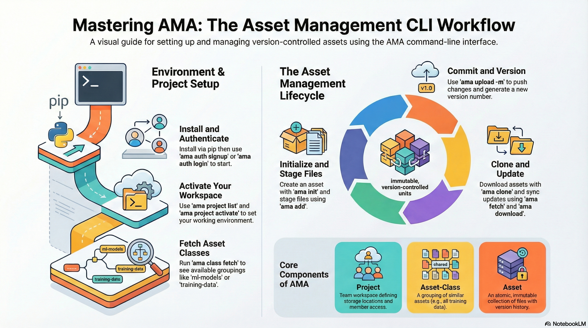

# AMA

Welcome to the official documentation for **AMA**. This repository contains the source code and comprehensive guides for the asset management system.

---
# Product Vision and Core Concepts

AMA (Asset-Manager) is a strategic enterprise solution engineered to govern the lifecycle of complex file collections within data science and machine learning environments. By providing a version-controlled, immutable storage architecture, AMA establishes a single source of truth for distributed teams. Rather than treating data as ephemeral file clusters, AMA formalizes storage into atomic units, ensuring that every model, dataset, and configuration remains auditable and reproducible across the development pipeline.

The system architecture is predicated on two primary entities: the Asset and the Asset-Class. An Asset is the atomic unit of the platform—a discrete, immutable collection of files that are versioned over time. The Asset-Class serves as the organizational framework, defining the schema, metadata requirements, and validation protocols for related assets. This structure allows teams to enforce naming conventions (using a <class-name>/<ordinal> format, where the ordinal is a system-generated sequence ID) and custom visualization rules, ensuring data remains discoverable and high-quality.

Feature	Asset	Asset-Class
Nature	Atomic unit (collection of files)	Logical grouping and foundational schema
Stability	Immutable once uploaded to remote	Governs validation and visualization rules
Versioning	Incremental versions (e.g., 0.0.0, 0.0.1)	Metadata-level synchronization
Naming	<class-name>/<ordinal> (Auto-generated ID)	User-defined category (e.g., ml-models)

These conceptual foundations provide the necessary rigor for managing the high-velocity data common in modern ML workflows.

# Environmental Configuration and Installation

For distributed teams, a standardized environment is the baseline for reliable asset synchronization. Establishing a consistent local configuration ensures that amapy interacts predictably with remote storage backends, eliminating the discrepancies often found in "ad-hoc" data management setups.

Requirements and Installation

Amapy requires a Python 3.10 environment. To deploy the interface to your local machine or compute node, use the standard package manager:

pip install amapy

Advanced Network Configuration

In high-availability environments such as Kubernetes clusters or automated CI/CD pipelines, DNS resolution can occasionally become a bottleneck or failure point. Amapy provides an advanced bypass mechanism to ensure connectivity by pointing directly to the Asset Server’s IP address.

export ASSET_SERVER_SKIP_DNS=true

Implementing this configuration is a critical "fail-safe" for automated pipelines, preventing interrupted data transfers during critical training or deployment stages. With the environment stabilized, the workflow moves to secure authentication and workspace isolation.

# Authentication and Project Workspace Management

The security architecture of AMA balances the need for interactive development with the requirements of headless, automated environments. By utilizing Google Authentication and token-based access, AMA ensures that access to sensitive project data is tightly controlled.

## Authentication Flow

The ama auth sub-command manages user identity. A successful login will display a confirmation message and the list of projects available to the user, such as the default ML-Model-Training project.

- Signup: ama auth signup -u <username> -e <email_address> (using organization credentials).
- Login: ama auth login (utilizes browser-based Google Authentication).
- Logout: ama auth logout (terminates the session and clears local credentials).

## Headless Machine Access

For remote servers or compute clusters lacking a browser interface, AMA employs a two-step token exchange:

- Extract Token: On a local machine with browser access, run ama auth info --token.
- Apply Token: On the remote machine, execute ama auth login --token <token>.

## Project Workspace Management

Projects serve as isolated workspaces that define storage backends (e.g., AWS S3, Google Cloud Storage) and team permissions. This isolation ensures multi-team data integrity:

* ama project list: Displays all workspaces authorized for your account.
* ama project activate <project_name>: Switches the active context (e.g., ama project activate ML-Model-Training).
* ama project info: Returns metadata regarding the active project’s storage and configuration.

After initializing the workspace, users must synchronize the organizational framework defined by asset-classes.

# Managing the Asset-Class Framework

Asset-classes function as the structural schema for data organization, governing metadata validation and ensuring that all assets within a category meet team standards.

## Class Lifecycle Commands

* Initialization: ama class init <class-name> launches the web-based dashboard to define a new category and its validation rules.
* Metadata Synchronization: ama class fetch is essential for collaborative environments; it retrieves the current list of classes and synchronizes all associated metadata from the remote project server.
* Discovery: ama class list displays available categories, while ama class info -n <class-name> provides technical details on a specific schema.

The ama class fetch command ensures that your local environment is aligned with the project’s global metadata state, preventing schema conflicts during asset development.

# The Asset Development Lifecycle (Creation to Upload)

The lifecycle of an asset moves from local initialization through a structured staging process, culminating in a permanent, versioned record on the remote server.

## Initialization and Directory Structure

To maintain organization, it is recommended to create a dedicated directory for each new asset. Initializing the asset defines its class and generates a local placeholder:

`ama init <class-name>`

During this phase, the asset name and version will have a temp_ prefix, indicating that the asset is currently local and untracked by the remote server.

## Asset Staging and State Transitions

Files within an asset directory progress through four distinct states, monitored via ama status:

* Untracked: New files not yet added to the asset structure.
* Staged: Files marked for inclusion in the next upload via ama add <file> or ama add ..
* Modified: Existing files that have been changed but not yet staged for the next version.
* Uploaded: Files committed to the remote server.

To stage changes for modified files that were already part of a previous version, use the update command:

`ama update <file_name>`

## Versioning and Sequence IDs

The transition to a permanent state occurs during the upload:

`ama upload -m "commit message"`

The first upload assigns a permanent Sequence ID (or ordinal). While this ID remains constant for the life of the asset, the Version Number increments (e.g., 0.0.0 to 0.0.1) with every subsequent ama upload. This system ensures that teams can reliably pin experiments to specific iterations while maintaining a continuous history of the asset.

# Asset Consumption, Versioning, and Retrieval

Strategic asset retrieval is fundamental to experiment reproducibility. AMA allows users to clone specific states and pivot between versions with minimal overhead.

## Technical Guide to Retrieval

* Cloning: ama clone <asset-name> downloads the latest version into a local directory formatted as <asset-class>/<ordinal>.
* Discovery: Use ama versions to view the full history of available versions before switching.
* Switching: ama switch --version <version_number> pivots the local environment to a specific historical state.

## Efficiency: Fetch vs. Download

AMA distinguishes between metadata and file transfers to optimize bandwidth:

* ama fetch: Pulls only the metadata and update logs from the remote.
* ama download: Pulls the actual underlying files to the local disk.

This separation allows users to inspect history and switch versions instantly, only triggering a heavy data transfer when new files are explicitly required.

## Peer and Historical Context

Users can maintain situational awareness within a class using ama list (to view peer assets) and ama history (to view all changes across versions). This context is vital for discovering related datasets or model iterations.

# Relationship Management and Discovery

In large-scale repositories, discovering assets and understanding their lineage is critical for ML reproducibility.

# Relationship Management: Asset Inputs

A high-impact feature for ML teams is the ability to link assets:

`ama inputs add <asset_version_name> --label <label_description>`

This allows an asset (e.g., a trained model) to reference its inputs (e.g., a specific training dataset version). This explicit linking ensures full lineage tracking for every experiment.

## Advanced Discovery and Verification

AMA uses hash-based verification to ensure data integrity across the platform:

* Integrity: ama info --hash provides a unique fingerprint, allowing users to verify if two assets are identical regardless of their names.
* Search: Use ama find --class <class> --hash <hash> to locate specific data.
* Aliases: Users can assign human-readable primary keys via ama alias add <alias>. Searching by alias (ama find --alias <alias>) simplifies discovery for "Gold Standard" or "Production" assets.
* Resource Planning: ama find --size <asset-name> allows teams to verify the data footprint before initiating a clone.

# The Asset Store: Local Optimization and Cache Management

The AMA Asset Store architecture is a global cache conceptually similar to Docker’s image management system. It optimizes local storage by managing files at a granular level across all projects.

## Global Cache Benefits

The Asset Store eliminates redundancy. If multiple assets or versions share identical files, the store keeps only one physical copy on disk and uses links for subsequent references. This significantly reduces the local storage footprint and accelerates ama switch operations.

## Maintenance Commands

* ama store info: Displays the health and path of the local cache.
* ama store prune: Removes orphaned or invalid entries to reclaim space.
* Warning: ama store clear: This command purges the local store. While cloned assets remain in their directories, any subsequent version switching will require a full ama download from the remote.

# Administrative Operations and Data Retention

AMA implements safety-first protocols for data deletion, utilizing a staged removal process to prevent accidental loss of critical research data.

## Deletion Protocols and Recovery

When an asset is scheduled for deletion, it enters a 30-day recovery window.

* Local Removal: ama delete <asset-id> (or ama delete --alias <alias>) removes the asset from the local cache immediately.
* Remote Deletion: ama schedule-deletion <asset-name> <days:optional> flags the asset for permanent removal. The <days> argument defaults to 30; values lower than 30 are ignored.

## Restoration Process

If an asset must be recovered within the window, use the ama restore <asset-name> command. To finalize the restoration in the local environment, the user must re-synchronize the metadata:

* ama fetch <class-name>: Restores specific class metadata.
* ama fetch --classes: Restores all class-level metadata after a class-level restoration.

The amapy toolset provides a robust, professional-grade framework for managing the entire asset lifecycle, ensuring the precision and efficiency required by modern ML teams.

---

## 🚀 Getting Started

If you are new to the project, start here to get up and running.

| Guide                                        | Description |
|:---------------------------------------------| :--- |
| **[Overview](docs/overview.md)**             | High-level summary of the project goals and scope. |
| **[Installation](docs/install.md)**               | Requirements and steps to install the environment. |
| **[Quick Start](docs/quick_start.md)**            | Run your first command in under 5 minutes. |
| **[Hello World](docs/user_guide/hello_world.md)** | A simple hands-on tutorial for end-users. |

---

## 🧠 Concepts & Architecture

Understand the theory and design behind the code.

* **[Architecture](docs/architecture.md)**: Diagrams and explanations of the system design.
* **[Core Concepts](docs/concepts/asset.md)**: Definitions of Assets, Objects, and the data model.
* **[Case Studies](docs/case_studies/model_training.md)**: Real-world examples and model training scenarios.

---

## 🛠️ Implementation Details

Deep dives into specific modules and internal logic.

### Asset Creation & Lifecycle
* **[Asset Init](docs/implementation/asset_create/asset_init.md)**: Procedures for initializing new asset repositories or local workspaces.
* **[Asset Add](docs/implementation/asset_create/asset_add2.md)**: Workflows for registering new assets into the system.
* **[Asset Upload](docs/implementation/asset_create/asset_upload.md)**: The specific mechanism for uploading asset binaries during creation.
* **[Asset Remove](docs/implementation/asset_create/asset_remove.md)**: Commands and safety checks for deleting or deprecating assets.
* **[Asset List](docs/implementation/asset_create/asset_list.md)**: Functionality for querying, listing, and filtering available assets.

### Asset Upload & Version Control
* **[Asset Upload Overview](docs/implementation/asset_upload/index.md)**: High-level guide to the upload lifecycle, classes, and commit strategies.
* **[Asset Class Create](docs/implementation/asset_upload/asset_class_create.md)**: Defining and registering new asset classes (types/categories).
* **[Stage Content](docs/implementation/asset_upload/stage_content.md)**: Preparing and staging data files prior to the final commit.
* **[Asset Commit](docs/implementation/asset_upload/asset_commit.md)**: Finalizing changes and versioning the staged asset content.

### Storage & Retrieval
* **[Bucket Storage](docs/implementation/asset_storage/bucket_storage.md)**: Implementation details for interacting with S3/Blob bucket storage.
* **[Asset Retrieval](docs/implementation/asset_download/index.md)**: Protocols and APIs for downloading and retrieving asset data.

### Internals

**Data Structures**
* **[Overview](docs/implementation/data_structures/index.md)**: High-level summary of the core data models and class hierarchy.
* **[Asset Class](docs/implementation/data_structures/asset_class.md)**: Definitions for asset categories, type configurations, and templates.
* **[Asset](docs/implementation/data_structures/asset.md)**: The core `Asset` entity structure, including identification, versioning, and metadata.
* **[Content](docs/implementation/data_structures/content.md)**: Data structures representing the physical files, payloads, or blobs attached to an asset.
* **[Object](docs/implementation/data_structures/object.md)**: The base generic `Object` class containing shared properties used across the system.

**System Logic**
* **[Schema](docs/implementation/schema/index.md)**: definitions for data validation, serialization rules, and database schemas.
* **[State Management](docs/implementation/state_management/index.md)**: Mechanisms for tracking application state, session context, and caching.

---

## 🐍 Python API Reference

For developers integrating this library into their own tools.

* **[API Documentation](docs/python_api/index.md)**: Full function and class reference.

---

## 📂 Repository Structure

A quick view of the top-level directory layout:

* `/client` - The client-side python component.
* `/docs` - Explanatory articles and diagrams.
* `/frontend` - [Docs](frontend/README.md) - The main codebase for all UI.
* `/server` - [Docs](server/amapy-server/README.md) - The server-side component of the ama system.

---
# Instructions

## Documentation generation

- Utility requirements are listed at `requirements.txt`
- Install the requirements
  - `pip install -r requirements.txt`
- Build documentation
  - `mkdocs build`
- Serve locally
  - `mkdocs serve -a localhost:8080`
- Deploy on GitHub Pages
  - `mkdocs gh-deploy --clean`