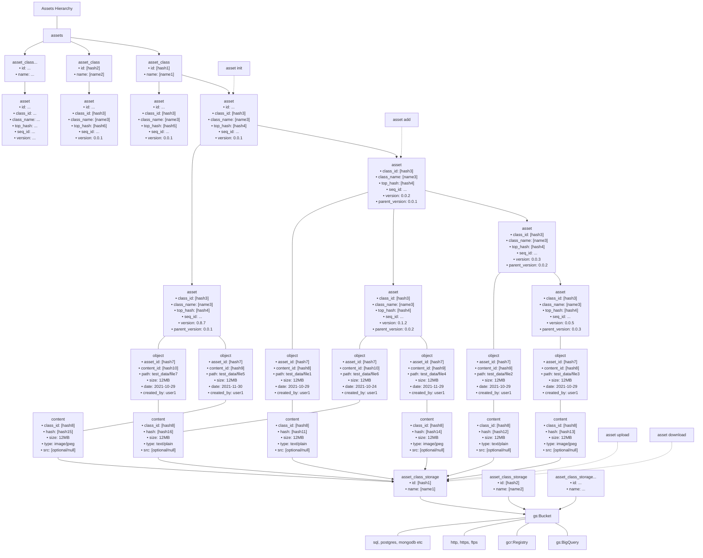

# Architecture

```mermaid
graph TD
    title[Assets Hierarchy]
    
    %% Top level
    assets[assets]
    
    %% Asset Classes
    ac1["asset_class
    • id: [hash1]
    • name: [name1]"]
    
    ac2["asset_class
    • id: [hash2]
    • name: [name2]"]
    
    ac3["asset_class...
    • id: ...
    • name: ..."]
    
    %% Assets level 1
    a1["asset
    • id: ...
    • class_id: [hash3]
    • class_name: [name3]
    • top_hash: [hash4]
    • seq_id: ...
    • version: 0.0.1"]
    
    a2["asset
    • id: ...
    • class_id: [hash3]
    • class_name: [name3]
    • top_hash: [hash5]
    • seq_id: ...
    • version: 0.0.1"]
    
    a3["asset
    • id: ...
    • class_id: [hash3]
    • class_name: [name3]
    • top_hash: [hash6]
    • seq_id: ...
    • version: 0.0.1"]
    
    a4["asset
    • id: ...
    • class_id: ...
    • class_name: ...
    • top_hash: ...
    • seq_id: ...
    • version: ..."]
    
    %% Assets level 2
    a5["asset
    • class_id: [hash3]
    • class_name: [name3]
    • top_hash: [hash4]
    • seq_id: ...
    • version: 0.0.2
    • parent_version: 0.0.1"]
    
    a6["asset
    • class_id: [hash3]
    • class_name: [name3]
    • top_hash: [hash4]
    • seq_id: ...
    • version: 0.0.3
    • parent_version: 0.0.2"]
    
    a7["asset
    • class_id: [hash3]
    • class_name: [name3]
    • top_hash: [hash4]
    • seq_id: ...
    • version: 0.0.5
    • parent_version: 0.0.3"]
    
    a8["asset
    • class_id: [hash3]
    • class_name: [name3]
    • top_hash: [hash4]
    • seq_id: ...
    • version: 0.1.2
    • parent_version: 0.0.2"]
    
    a9["asset
    • class_id: [hash3]
    • class_name: [name3]
    • top_hash: [hash4]
    • seq_id: ...
    • version: 0.8.7
    • parent_version: 0.0.1"]
    
    %% Objects
    o1["object
    • asset_id: [hash7]
    • content_id: [hash8]
    • path: test_data/file1
    • size: 12MB
    • date: 2021-10-29
    • created_by: user1"]
    
    o2["object
    • asset_id: [hash7]
    • content_id: [hash9]
    • path: test_data/file2
    • size: 12MB
    • date: 2021-10-29
    • created_by: user1"]
    
    o3["object
    • asset_id: [hash7]
    • content_id: [hash8]
    • path: test_data/file3
    • size: 12MB
    • date: 2021-10-29
    • created_by: user1"]
    
    o4["object
    • asset_id: [hash7]
    • content_id: [hash9]
    • path: test_data/file4
    • size: 12MB
    • date: 2021-11-29
    • created_by: user1"]
    
    o5["object
    • asset_id: [hash7]
    • content_id: [hash9]
    • path: test_data/file5
    • size: 12MB
    • date: 2021-11-30
    • created_by: user1"]
    
    o6["object
    • asset_id: [hash7]
    • content_id: [hash10]
    • path: test_data/file6
    • size: 12MB
    • date: 2021-10-24
    • created_by: user1"]
    
    o7["object
    • asset_id: [hash7]
    • content_id: [hash10]
    • path: test_data/file7
    • size: 12MB
    • date: 2021-10-29
    • created_by: user1"]
    
    %% Contents
    c1["content
    • class_id: [hash8]
    • hash: [hash11]
    • size: 12MB
    • type: text/plain
    • src: [optional/null]"]
    
    c2["content
    • class_id: [hash8]
    • hash: [hash12]
    • size: 12MB
    • type: text/plain
    • src: [optional/null]"]
    
    c3["content
    • class_id: [hash8]
    • hash: [hash13]
    • size: 12MB
    • type: image/jpeg
    • src: [optional/null]"]
    
    c4["content
    • class_id: [hash8]
    • hash: [hash14]
    • size: 12MB
    • type: image/jpeg
    • src: [optional/null]"]
    
    c5["content
    • class_id: [hash8]
    • hash: [hash15]
    • size: 12MB
    • type: image/jpeg
    • src: [optional/null]"]
    
    c6["content
    • class_id: [hash8]
    • hash: [hash16]
    • size: 12MB
    • type: text/plain
    • src: [optional/null]"]
    
    %% Asset class storage
    acs1["asset_class_storage
    • id: [hash1]
    • name: [name1]"]
    
    acs2["asset_class_storage
    • id: [hash2]
    • name: [name2]"]
    
    acs3["asset_class_storage...
    • id: ...
    • name: ..."]
    
    %% Bottom level services
    gs[gs:Bucket]
    bq[gs:BigQuery]
    gcr[gcr:Registry]
    http["http, https, ftps"]
    sql["sql, postgres, mongodb etc"]
    
    %% Process labels
    process1["asset init <class_name>"]
    process2["asset add <file | dir>"]
    process3["asset upload"]
    process4["asset download"]
    
    %% Connections
    title --- assets
    
    assets --> ac1
    assets --> ac2
    assets --> ac3
    
    ac1 --> a1
    ac1 --> a2
    ac2 --> a3
    ac3 --> a4
    
    process1 -.-> a1
    
    a1 --> a5
    a5 --> a6
    a6 --> a7
    a5 --> a8
    a1 --> a9
    
    process2 -.-> a5
    
    a5 --- o1
    a6 --- o2
    a7 --- o3
    a8 --- o4
    a9 --- o5
    a8 --- o6
    a9 --- o7
    
    o1 --- c1
    o2 --- c2
    o3 --- c3
    o4 --- c4
    o5 --- c5
    o6 --- c6
    o7 --- c6
    
    c1 --> acs1
    c2 --> acs1
    c3 --> acs1
    c4 --> acs1
    c5 --> acs1
    c6 --> acs1
    
    process3 -.-> acs1
    process4 -.-> acs1
    
    acs1 --> gs
    acs2 --> gs
    acs3 --> gs
    
    gs --- bq
    gs --- gcr
    gs --- http
    gs --- sql
```

 
