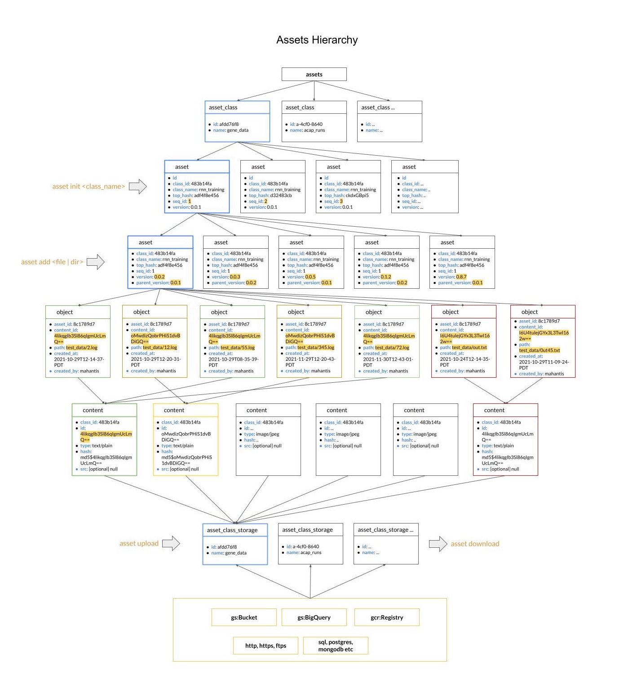
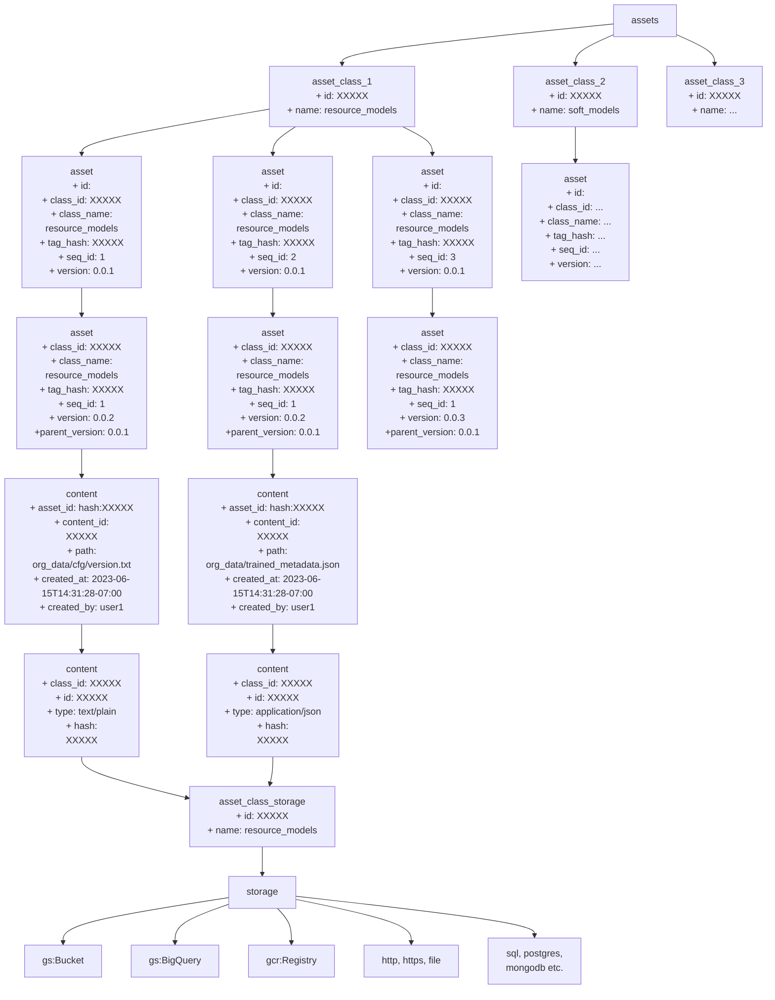

# Architecture

```mermaid
graph TD
    assets[assets] --> asset_class1[asset_class_1<br>+ id: XXXXX<br>+ name: resource_models]
    assets --> asset_class2[asset_class_2<br>+ id: XXXXX<br>+ name: soft_models]
    assets --> asset_class3[asset_class_3<br>+ id: XXXXX<br>+ name: ...]
    
    asset_class1 --> asset1[asset<br>+ id:<br>+ class_id: XXXXX<br>+ class_name:<br>resource_models<br>+ tag_hash: XXXXX<br>+ seq_id: 1<br>+ version: 0.0.1]
    asset_class1 --> asset2[asset<br>+ id:<br>+ class_id: XXXXX<br>+ class_name:<br>resource_models<br>+ tag_hash: XXXXX<br>+ seq_id: 2<br>+ version: 0.0.1]
    asset_class1 --> asset3[asset<br>+ id:<br>+ class_id: XXXXX<br>+ class_name:<br>resource_models<br>+ tag_hash: XXXXX<br>+ seq_id: 3<br>+ version: 0.0.1]
    
    asset_class2 --> asset4[asset<br>+ id:<br>+ class_id: ...<br>+ class_name: ...<br>+ tag_hash: ...<br>+ seq_id: ...<br>+ version: ...]
    
    asset1 --> asset_v1[asset<br>+ class_id: XXXXX<br>+ class_name:<br>resource_models<br>+ tag_hash: XXXXX<br>+ seq_id: 1<br>+ version: 0.0.2<br>+parent_version: 0.0.1]
    
    asset2 --> asset_v2[asset<br>+ class_id: XXXXX<br>+ class_name:<br>resource_models<br>+ tag_hash: XXXXX<br>+ seq_id: 1<br>+ version: 0.0.2<br>+parent_version: 0.0.1]
    
    asset3 --> asset_v3[asset<br>+ class_id: XXXXX<br>+ class_name:<br>resource_models<br>+ tag_hash: XXXXX<br>+ seq_id: 1<br>+ version: 0.0.3<br>+parent_version: 0.0.1]
    
    asset_v1 --> content1[content<br>+ asset_id: hash:XXXXX<br>+ content_id:<br>XXXXX<br>+ path:<br>org_data/cfg/version.txt<br>+ created_at: 2023-06-15T14:31:28-07:00<br>+ created_by: user1]
    
    asset_v2 --> content2[content<br>+ asset_id: hash:XXXXX<br>+ content_id:<br>XXXXX<br>+ path:<br>org_data/trained_metadata.json<br>+ created_at: 2023-06-15T14:31:28-07:00<br>+ created_by: user1]
    
    content1 --> content_details1[content<br>+ class_id: XXXXX<br>+ id: XXXXX<br>+ type: text/plain<br>+ hash:<br>XXXXX]
    
    content2 --> content_details2[content<br>+ class_id: XXXXX<br>+ id: XXXXX<br>+ type: application/json<br>+ hash:<br>XXXXX]
    
    content_details1 --> storage[asset_class_storage<br>+ id: XXXXX<br>+ name: resource_models]
    content_details2 --> storage
    
    storage --> storage_options[storage]
    
    storage_options --> bucket[gs:Bucket]
    storage_options --> bigquery[gs:BigQuery]
    storage_options --> registry[gcr:Registry]
    storage_options --> files[http, https, file]
    storage_options --> db[sql, postgres,<br>mongodb etc.]
```

 
