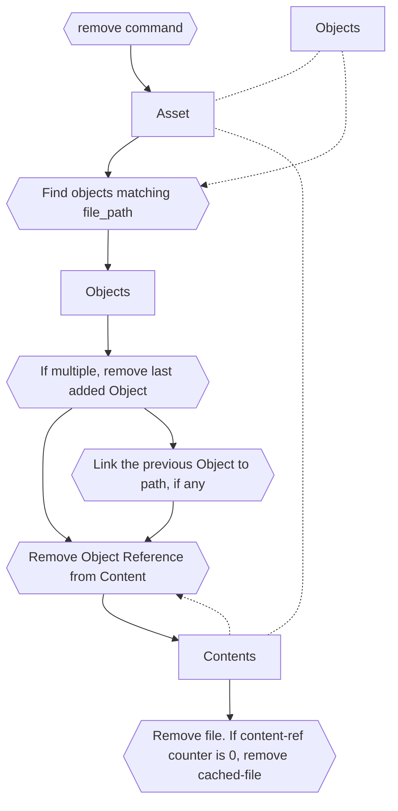

### Removing files from an asset

<pre class="code">
cd your_dir
ama remove file
</pre>

The following steps are performed.





* Normalize the user-input path to asset_repo dir
* Find all objects that match the path ```asset.objects.filter(lambda x: x.path == path)```
* Remove the object from asset, if multiple objects, we remove the last added object
* Remove the object reference from linked content, if ref count of content is 0 - remove the cached file pointed to by the content
* If multiple Objects were found earlier, and we had removed the last object then we link the previous object to the file-path
