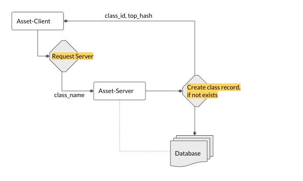

#### Create BaseAsset-Class

It's the asset_class that owns the storage location. So in order to be eligible for upload, an asset must have a valid
class_id

- Check if the asset has a class_id, if not - request asset_registry for id of the asset_class
- The request to asset_registry must include class_name
- asset_registry receives the request, checks if an asset_class exists for the given name. If not, the asset_registry creates an asset_class.
- client receives the class_id and top_hash from the asset_registry and updates the asset-manifest
- Asset is now eligible for upload
 


```mermaid

```

<br>
