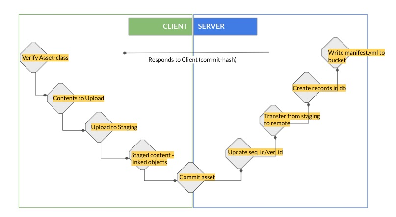

## Uploading BaseAsset

```mermaid
flowchart LR
subgraph CLIENT [CLIENT]
        C1[Verify Asset-class]
        C2[Contents to Upload]
        C3[Upload to Staging]
        C4[Staged content - linked objects]
        C5[Commit asset]
    end
    subgraph SERVER [SERVER]
        S1[Update seq_id/ver_id]
        S2[Transfer from staging to remote]
        S3[Create records in db]
        S4[Write manifest.yml to bucket]
        S5[Responds to Client commit-hash]
    end
    
    
    
    C1 --> C2
    C2 --> C3
    C3 --> C4
    C4 --> C5
    C5 --> S1
    S1 --> S2
    S2 --> S3
    S3 --> S4
    S4 --> S5
    
        SERVER -. Response from server .-> CLIENT
    
    %% Styling
    classDef clientBox fill:#8BC34A,stroke:#333,color:black
    classDef serverBox fill:#2196F3,stroke:#333,color:black
    classDef clientNode fill:#FFC107,stroke:#333,color:black,shape:diamond
    classDef serverNode fill:#FFC107,stroke:#333,color:black,shape:diamond
    
    class CLIENT clientBox
    class SERVER serverBox
    class C1,C2,C3,C4,C5 clientNode
    class S1,S2,S3,S4,S5 serverNode
```






