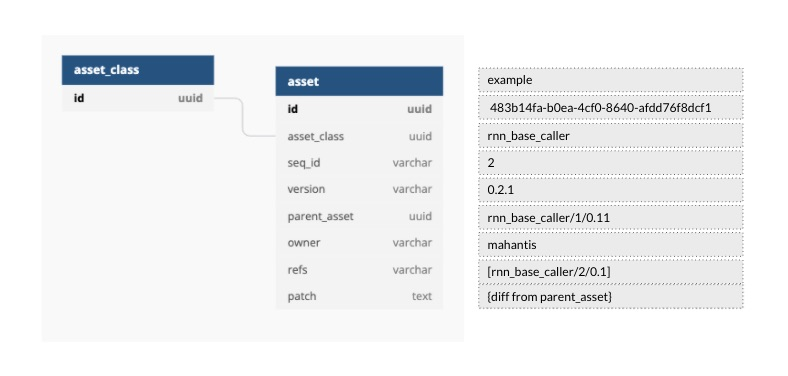

#### Asset

<div class="justified">
Everytime you call ```ama init <class_name>```, it creates an Asset i.e. new member of the asset-class. On a high level
an Asset represents a collection of all digital resources you need for your activity. Assets are automatically version tracked,
any changes you make to an asset if diffed and stored separately which can be inspected and traced back to source.
</div>



```mermaid

```
