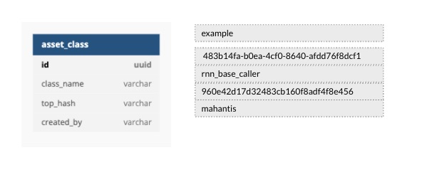

#### Asset Class

<div class="justified">
Conceptually, the Asset class is a classification of similar types of assets
depending on the use case. You could define a `text_analysis` asset-class to store relevant assets pertaining to
natural language processing components. Similarly, you might declare a `model_training` or `sequence_analyzer` asset-class to manage all their relevant
assets. All assets belonging to an asset-class share the same storage in the cloud bucket, which helps optimize storage requirements
since files with the same content need not be uploaded again.
</div>



```mermaid

```
