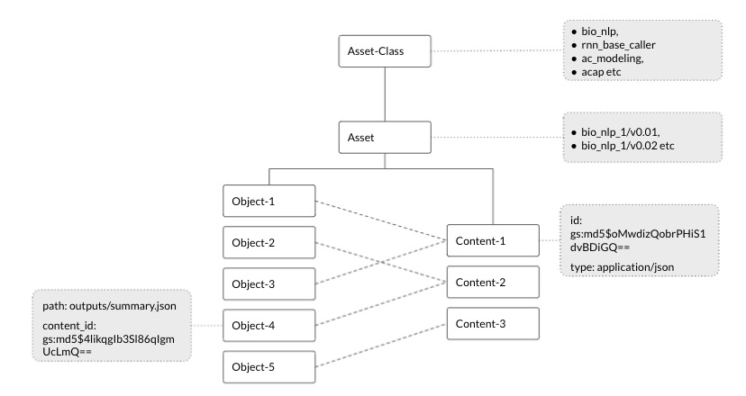
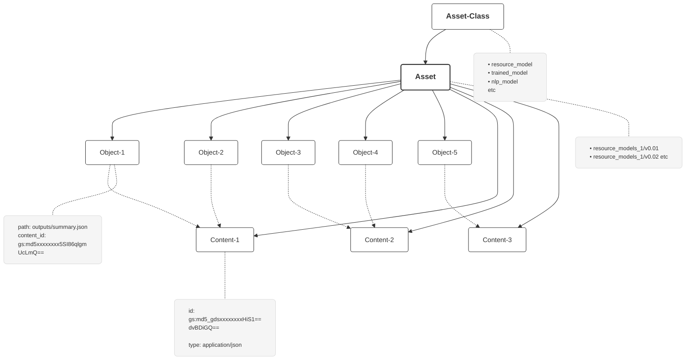

## Data Structures

```mermaid
graph TD
    %% Main hierarchy
    AssetClass["Asset-Class"] --> Asset
    Asset --> Object1["Object-1"]
    Asset --> Object2["Object-2"]
    Asset --> Object3["Object-3"]
    Asset --> Object4["Object-4"]
    Asset --> Object5["Object-5"]
    Asset --> Content1["Content-1"]
    Asset --> Content2["Content-2"]
    Asset --> Content3["Content-3"]
    
    %% Relationships between objects and content
    Object1 -.-> Content1
    Object2 -.-> Content1
    Object3 -.-> Content2
    Object4 -.-> Content2
    Object5 -.-> Content3
    
    %% Info boxes with annotations
    AssetClass -.- AssetClassInfo["• resource_model<br>• trained_model<br>• nlp_model<br> etc"]
    Asset -.- AssetInfo["• resource_models_1/v0.01<br>• resource_models_1/v0.02 etc"]
    Content1 -.- ContentInfo["id:<br>gs:md5_gdsxxxxxxxxHiS1==<br>dvBDiGQ==<br><br>type: application/json"]
    Object1 -.- ObjectInfo["path: outputs/summary.json<br>content_id:<br>gs:md5xxxxxxxx5SI86qlgm<br>UcLmQ=="]
    
    %% Styling
    classDef mainNode fill:white,stroke:#333,stroke-width:1px,rx:4px,ry:4px,font-family:Arial,font-size:14px;
    classDef infoBox fill:#f5f5f5,stroke:#ddd,stroke-width:1px,rx:6px,ry:6px,font-family:Arial,font-size:12px,text-align:left;
    classDef assetClassNode fill:white,stroke:#333,stroke-width:1px,rx:4px,ry:4px,font-weight:bold;
    classDef assetNode fill:white,stroke:#333,stroke-width:2px,rx:4px,ry:4px,font-weight:bold;
    
    %% Apply styles
    class AssetClass assetClassNode;
    class Asset assetNode;
    class Object1,Object2,Object3,Object4,Object5,Content1,Content2,Content3 mainNode;
    class AssetClassInfo,AssetInfo,ContentInfo,ObjectInfo infoBox;
    
    %% Layout adjustments
    subgraph ObjectGroup [" "]
        Object1
        Object2
        Object3
        Object4
        Object5
    end
    
    subgraph ContentGroup [" "]
        Content1
        Content2
        Content3
    end
    
    %% Make subgraph backgrounds transparent
    classDef transparent fill:transparent,stroke:transparent;
    class ObjectGroup,ContentGroup transparent;
```








