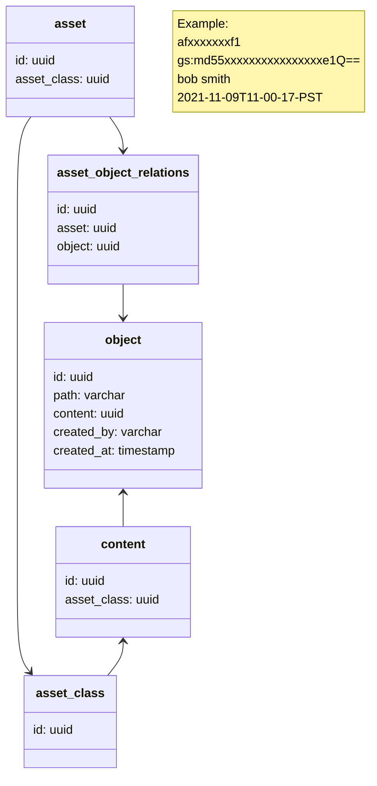

#### Object

Asset holds a collection of objects. An Object is a relation between Content and a file path inside the asset-repo dir of the user.

* Object to Content is a many-to-one relationship i.e. multiple Objects can point to the same content
* Each record in the Objects Table has a foreign Key to the Contents Table. 
* Object to Asset is a many-to-many relationship i.e. an Asset holds multiple Objects and the same object can be shared by multiple Assets.
* The AssetObjects Join table maintains the relationship between Objects and Assets
* Objects are stored in the Objects Table in the database and in the asset-manifest.yaml file in the bucket
