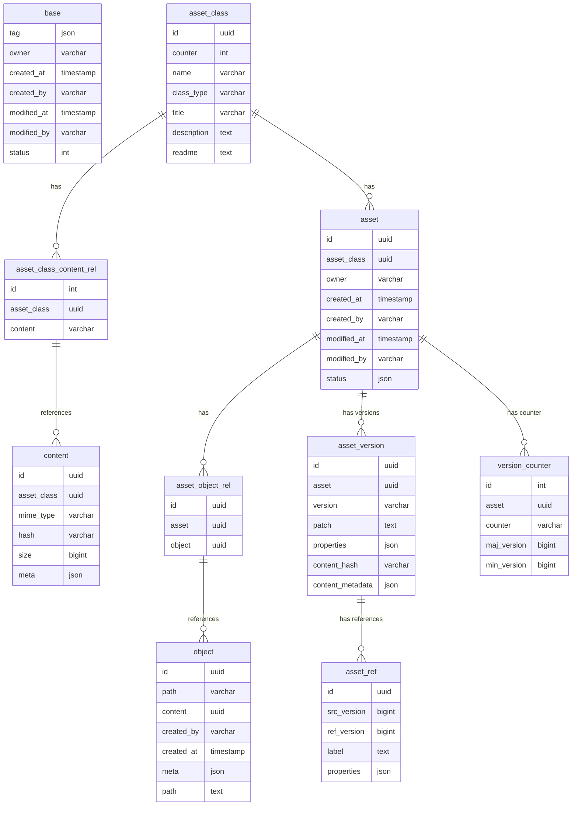

## Schema

<iframe width="690" height="375" src='https://dbdiagram.io/embed/6290fbd3f040f104c1ae51b6'> </iframe>

```mermaid
erDiagram
    base{
        tag json
        owner varchar
        created_at timestamp
        created_by varchar
        modified_at timestamp
        modified_by varchar
        status int
    }
    asset_class {
        id uuid
        counter int
        name varchar
        class_type varchar
        title varchar
        description text
        readme text
    }
    
    asset {
        id uuid
        asset_class uuid
        owner varchar
        created_at timestamp
        created_by varchar
        modified_at timestamp
        modified_by varchar
        status json
    }
    
    asset_class_content_rel {
        id int
        asset_class uuid
        content varchar
    }
    
    content {
        id uuid
        asset_class uuid
        mime_type varchar
        hash varchar
        size bigint
        meta json
    }
    
    object {
        id uuid
        path varchar
        content uuid
        created_by varchar
        created_at timestamp
        meta json
        path text
    }
    
    asset_object_rel {
        id uuid
        asset uuid
        object uuid
    }
    
    asset_version {
        id uuid
        asset uuid
        version varchar
        patch text
        properties json
        content_hash varchar
        content_metadata json
    }
    
    version_counter {
        id int
        asset uuid
        counter varchar
        maj_version bigint
        min_version bigint
    }
    
    asset_ref {
        id uuid
        src_version bigint
        ref_version bigint
        label text
        properties json
    }
    
    asset_class ||--o{ asset : "has"
    asset_class ||--o{ asset_class_content_rel : "has"
    asset_class_content_rel ||--o{ content : "references"
    asset ||--o{ asset_object_rel : "has"
    asset_object_rel ||--o{ object : "references"
    asset ||--o{ asset_version : "has versions"
    asset ||--o{ version_counter : "has counter"
    asset_version ||--o{ asset_ref : "has references"

```

 